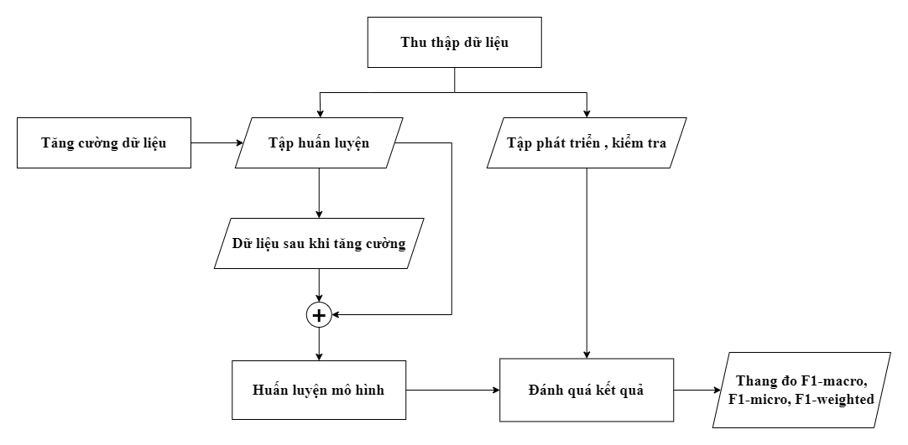

# Nghiên cứu đánh giá các kỹ thuật tăng cường dữ liệu cho bài toán phân tích cảm xúc Tiếng Việt

# Tóm tắt

Nghiên cứu này tập trung vào việc nghiên cứu đánh giá các kỹ thuật tăng cường dữ liệu cho bài toán phân tích cảm xúc trong tiếng Việt, một trong các lĩnh vực quan trọng của Xử lý Ngôn ngữ Tự nhiên (NLP). Phân tích cảm xúc là việc hiểu và phân tích ý kiến và cảm xúc của con người trong văn bản, đóng vai trò quan trọng trong việc đánh giá sự hài lòng của khách hàng, theo dõi tình hình thị trường, và nhiều ứng dụng khác. Tuy nhiên, trong tiếng Việt, việc hiện có một lượng lớn dữ liệu chất lượng để huấn luyện các mô hình phân tích cảm xúc vẫn còn là một thách thức lớn. Gán nhãn cảm xúc cho văn bản tiếng Việt đòi hỏi sự hiểu biết sâu về ngôn ngữ và ngữ cảnh cụ thể, và quá trình thu thập dữ liệu thường tốn nhiều thời gian và công sức. Vì vậy, nghiên cứu về các phương pháp để tăng cường dữ liệu cho phân tích cảm xúc tiếng Việt là điều cần thiết. Chúng tôi thực hiện đề tài “Nghiên cứu đánh giá các kỹ thuật tăng cường dữ liệu cho bài toán phân tích cảm xúc tiếng Việt” nhằm giải quyết sự hạn chế của dữ liệu bằng cách tạo dữ liệu mới và đa dạng thông qua các phương pháp tăng cường. Kết quả thí nghiệm cho thấy phương pháp tăng cường dữ liệu nâng cao hiệu quả
của mô hình phân loại ở các bộ dữ liệu thử nghiệm.

# 1. Quy trình thực hiện tăng cường dữ liệu và thực nghiệm

**Hình 1. Quy trình thực hiện tăng cường dữ liệu và thực nghiệm**

- Thu thập dữ liệu: các bộ dữ liệu được chia thành 3 tập khác nhau bao gồm
  tập huấn luyện, pháp triển và thử nghiệm để phục vụ cho quá trình thực
  nghiệm.
- Tăng cường dữ liệu: ở bước này các kỹ thuật tăng cường dữ liệu được áp
  dụng trên tập huấn luyện để tạo ra dữ liệu tăng cường.
- Huấn luyện mô hình: sử dụng dữ liệu huấn luyện gốc kết hợp với dữ liệu sau
  khi tăng cường theo từng kỹ thuật tăng cường để huấn luyện các bộ phân
  loại cảm xúc.
- Đánh giá kết quả: để đánh giá hiệu quả của các phương pháp tăng cường dữ
  liệu, chúng tôi tiến hành thực nghiệm bằng cách đánh giá các bộ phân loại
  đã được huấn luyện bằng dữ liệu tăng cường trên tập kiểm tra, sử dụng các
  thang đo F1-macro, F1-micro và F1-weighted.

# 2. Các kỹ thuật tăng cường dữ liệu

## Tăng cường dữ liệu ở cấp từ

Tăng cường cấp từng từ bao gồm việc biến đổi một hoặc một số từ trong một câu để tạo ra văn bản tăng cường. Mục tiêu là tạo ra các biến thể của câu trong khi vẫn giữ nguyên ý nghĩa ngữ nghĩa và nhãn cảm xúc ban đầu của văn bản. Chúng tôi đề xuất các kỹ thuật tăng cường cấp từ sau:

- Xóa ngẫu nhiên (Random delete): Kỹ thuật này loại bỏ một hoặc một số từ ngẫu nhiên khỏi văn bản đầu vào.
- Đổi chỗ ngẫu nhiên (Random swap): Trong kỹ thuật này, một hoặc một số cặp từ được chọn ngẫu nhiên trong câu để đổi chỗ chỗ
- Thay thế ngẫu nhiên (Random replace): Trong phương pháp này, các từ được chọn ngẫu nhiên và thay thế. Chiến lược bao gồm việc thay thế bằng từ đồng nghĩa (Synonym), sử dụng các vectơ nhúng Word2Vec, thay thế dựa trên TF-IDF và thay thế dựa trên mô hình ngôn ngữ – BERT.
- Chèn ngẫu nhiên (Random insert): Kỹ thuật tăng cường này liên quan đến việc chèn các từ vào các vị trí ngẫu nhiên trong câu. Tương tự như thay thế, việc chèn có thể đạt được bằng cách sử dụng từ đồng nghĩa, nhúng Word2Vec, điểm TF-IDF hoặc BERT

## Tăng cường dữ liệu ở cấp câu - Dịch ngược

Dịch các câu tiếng Việt sang tiếng Anh và sau đó dịch ngược lại, ta
tạo ra các câu mới có nghĩa tương tự nhưng có thể mang cảm xúc khác nhau,
làm phong phú thêm tập dữ liệu với cấu trúc câu và từ vựng đa dạng.

# 3. Các bộ phân loại

Chúng tôi đánh giá các kỹ thuật tăng cường dữ liệu đã đề xuất của mình bằng cách sử dụng một loạt các mô hình thuộc các nhóm phương pháp khác nhau như: tinh chỉnh các mô hình ngôn ngữ lớn, học máy, học sâu:

- Tinh chỉnh các mô hình ngôn ngữ: Chúng tôi đã thực hiện việc tinh chỉnh hai mô hình ngôn ngữ lớn, trong đó có một mô hình dành riêng cho tiếng Việt - PhoBERT và một mô hình đa ngôn ngữ XLM- RoBERTa. PhoBERT được đào tạo đặc biệt cho tiếng Việt, điều này làm cho PhoBERT trở thành một công cụ mạnh mẽ trong các tác vụ liên quan đến tiếng Việt. Trong khi đó, XLM-RoBERTa là một biến thể khác của mô hình RoBERTa có khả năng biểu diễn văn bản tự nhiên mạnh mẽ.
- Mô hình máy học truyền thống: Thay vì sử dụng mô hình TF – IDF, một phương pháp thường được sử dụng trong các tác cụ biểu diễn văn bản tiếng Việt, chúng tôi đã sử dụng laBSE – một mô hình biểu diễn văn bản đa ngôn ngữ được cho là cho kết quả tốt nhất trên bộ dữ liệu hỗn hợp Việt – Anh để biễu diễn các văn bản thành các vector nhúng. Sau đó sử dụng các các vector này để huấn luyện các thuật toán Support Vector Machines - SVM, Nayve Bayes - NB, Multilayer Perceptron - MLP.
- Mô hình học sâu: Đối với phương pháp học sâu, chúng tôi đã xây dựng một mô hình mạng nơ-ron tích chập Convolutional Neural Network - CNN

# 4. Kết quả thực nghiệm

Chi tiết nghiên cứu này như bộ dữ liệu, kết quả thực nghiệm, nhận xét kết quả có thê xem ở file <Nghiên cứu đánh giá các kỹ thuật tăng cường dữ liệu cho bài toán phân tích cảm xúc Tiếng Việt.pdf>

# 5. Giải thích về source code

## Dữ liệu huấn luyện

Trong bài báo nay, chúng tôi thực hiện phân tích cảm xúc trong lĩnh vực khách sạn trên hai bộ dữ liệu. Trong đó có một bộ dữ liệu Nhận xét tiếng Việt (bao gồm câu nhận xét bằng tiếng Việt) và bộ dữ liệu Nhận xét hỗn hợp Việt – Anh
(bao gồm các câu nhận xét chứa cả tiếng Anh và tiếng Việt) để thực nghiệm các kỹ thuật tăng cường dữ liệu. Mỗi bộ dữ liệu sẽ có 3 nhãn: tích cực, trung tính, tiêu cực. Dữ liệu này được lưu ở file ./source_code/data/keyword_replace.csv chứa.

## Chuẩn bị dữ liệu

Trong quá trình tăng cường dữ liệu có nhiều phiên bản dữ liệu dã được tạo ra. Để thuận tiện cho quá trình lưu trữ và huấn luyện chúng tôi chia dữ liệu thành 3 tập train, dev, test với tỉ lệ tương ứng. \
Source code quá trình xử lý: Prepare_data.ipynb \
Kết quả của quá trính xử lý: ./source_code/data/Final_Mixed.pkl và ./source_code/data/Final_VietNam.pkl

## Tăng cường dữ liệu

Quá trình tăng cường và kết quả tăng cường sữ liệu sẽ được cập nhật trực tiếp vào 2 file .pkl ở trên. \
Source code tăng cường: ./source_code/Aumentation_code.ipynb
